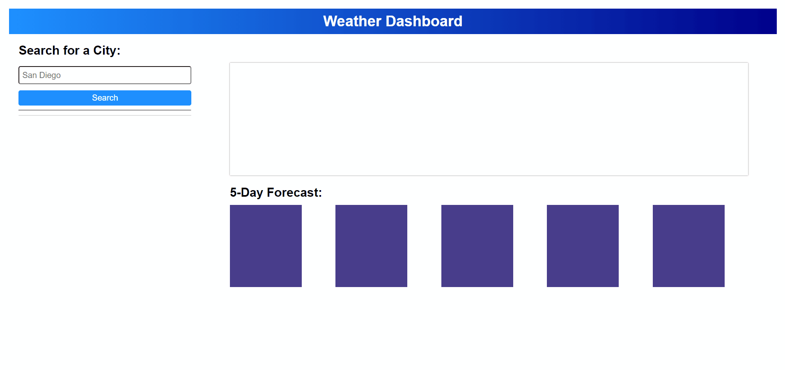

	

# VaycayRC

The 6th assignment for the Rutgers Coding Bootcamp: A web app that lets you check the weather in various cities before planning your getaway (assuming no COVID-19)

# Table of Contents

- [VaycayRC](#vaycayrc)
- [Table of Contents](#table-of-contents)
- [Etymology](#etymology)
- [Demo](#demo)

# Etymology

Vaycay = vacation
rc = .bashrc, .nvmrc, etc. (the files that run before/at the start of a process)

Vaycay + rc = VaycayRC. Thank you for coming to my TED Talk 🕺

# Demo

